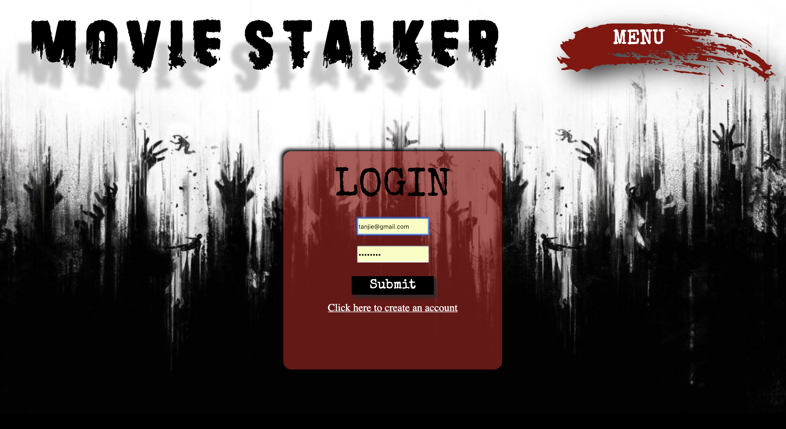

# **MOVIE TRACKER**

MOVIE TRACKER is a web based application built in React that allows the user to save and favorite a collection of recent popular films based on a horror movie theme. Users can view films by title and poster art, as well as browse films by release date and overview. Movie data is fetched and populated via [The Movie Database API](https://www.themoviedb.org/documentation/api). Account handling is executed via a local backend server.

### Installation and Setup Instructions

````
go to https://www.themoviedb.org/documentation/api request an api key
````

```
Starting up the backend:

git clone https://github.com/turingschool-examples/movie-tracker

Rename the movie-tracker directory 'movietracker-backend'

cd into the 'movietracker-backend' directory

npm install

npm start
````
````
Starting up the frontend:

git clone https://github.com/TMcMeans/movietracker-frontend

cd into the 'movietracker-frontend' directory

create a file in src called apikey.js

set up file like this:
export const key = 'your key here'

npm install

npm start- say yes if asked if you should start the server on a new port
````

### Project Goals

Our goals for this project were to:

- Utilize the The Movie Database API to fetch, store and display movie data
- Connect to a local backend database to save user data and allow users to sign in/sign out
- Build UI that allows for favoriting and un-favoriting unique movies saved in a logged in user's collection
- Use React Router to add routing capability and navigation to different areas of the application
- Integrate Redux architecture as a global state management tool to access data on the frontend
- Employ test driven development (TDD) in production of the application and provide full test coverage for all aspects including async functionality and Redux

### Team

Tanj McMeans- [Github](https://github.com/TMcMeans)

Loryn Mason- [Github](https://github.com/lorynmason)

Mike Duke- [Github](https://github.com/mike-duke)

### Technologies and Resources

- React
- React Router
- Redux
- Redux Thunks/Middleware
- Enzyme/Jest
- REST API
- HTML5
- SASS
- Git Rebase Workflow
- Github

### Original Wireframe


### Implementation




